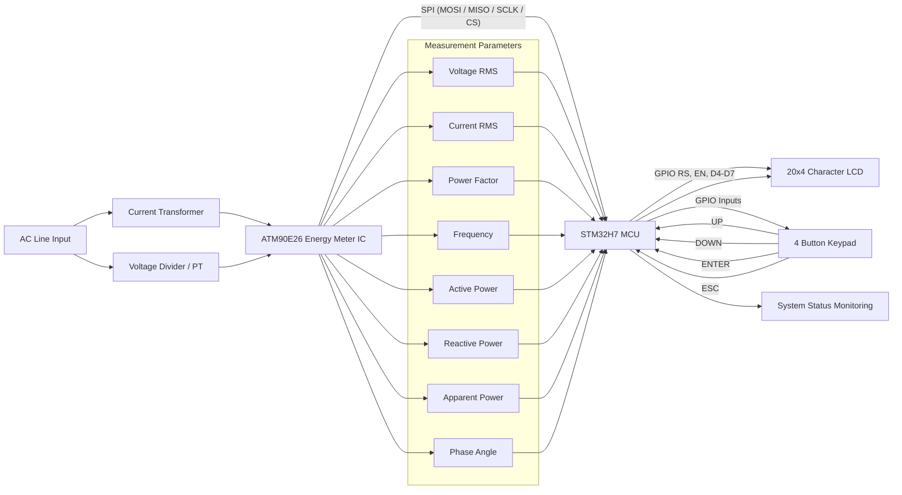

# STM32H7 ATM90E26 Energy Meter Firmware

Professional-grade firmware for a **single-phase energy metering system** built on the **STM32H7 series MCU** and the **ATM90E26 energy metering IC**.

The firmware reads real-time electrical parameters over SPI and displays them on a **20x4 character LCD** with a **menu-driven user interface** controlled via a **4-button keypad**.

---

## System Overview

This project integrates:

STM32H7 MCU  
ATM90E26 Energy Metering IC  
20x4 Character LCD (4-bit mode)  
4-Button Keypad (UP / DOWN / ENTER / ESC)

The system continuously measures:

- RMS Voltage
- RMS Current
- Power Factor (Signed)
- Frequency
- Active Power
- Reactive Power
- Apparent Power
- Phase Angle

---

## Wiring Diagram 

## Core Components

### LCD Driver (20x4_LCD.c)

Implements a 20x4 character LCD interface in **4-bit mode** using GPIO.

Features:
- LCD initialization
- Cursor positioning
- Menu rendering
- Live measurement display
- Formatted printing using snprintf
- UI state rendering

### Metering Interface (ATM90E26_Metering.c)

Handles communication with the ATM90E26 energy metering IC.

SPI configuration:
- Mode 3
- Software Chip Select
- Low communication speed for stability

Features:
- Register read/write
- Initialization sequence
- Calibration block verification
- Checksum validation
- Metering enable
- RMS measurement configuration

---

## Optimizations Implemented

Keypad debouncing  
Stable RMS sampling  
Non-blocking UI updates  
Minimal LCD refresh to prevent flicker  
Structured firmware architecture  

Testing Mode Features:

- No-load threshold disabled
- Creep detection disabled
- Raw register monitoring enabled

---

## Build Environment

STM32CubeIDE  
HAL Drivers  
ARM GCC Toolchain  

Target MCU:

STM32H7A3RIT6

---

## Future Improvements

Calibration menu  
Energy accumulation display  
Data logging  
Modbus / RS485 support  
Cloud telemetry  

---
